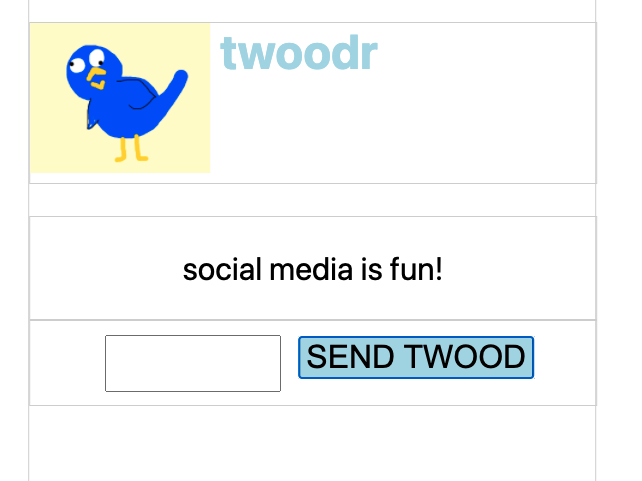
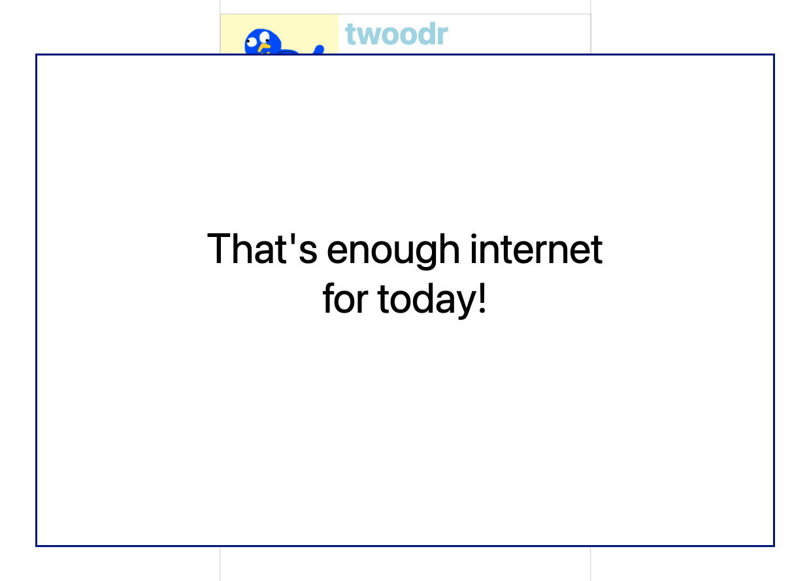
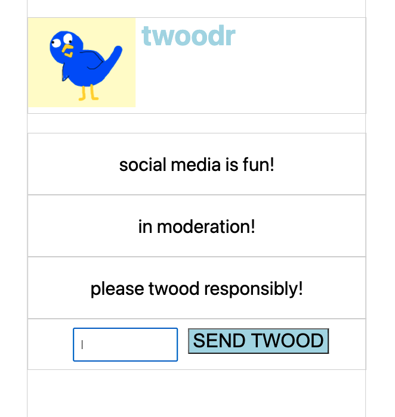
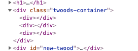

# Twoodr
We're going to make a "clone" (very liberal use of the word clone) of a popular social media app that we definitely do not have copyright concerns about.

## Version 0
Take a look at the existing `index.html` and `style.css`. Are there any new tags you haven't encountered before? Open `index.html` in your browser and try to interact with it. Which parts are already functional and which aren't?

## Version 1

The first version we want to build has the following user stories:
1. When I type into the input box, and then click the "SEND TWOOD" button, the text I typed gets placed into the "Twood displays here!" div, and the input gets cleared out
1. When I send a subsequent twood, the new text replaces the old text. (So there will only ever be 1 twood on the screen for v1.)

Note that we are making an _MVP_, or Minimum Viable Product. In pretty much every project you do, you want to start off by identifying: What's the smallest, most bare minimum version of this project that I could build first, and then add onto?

You should create a js file, link it, and add code to it to perform the following steps:
1. Select the input field, and harvest the current text value from it. (Hint: google something like "js get input text")
1. We don't want to harvest this text value as soon as the page opens, we want it to happen once the user clicks the button. You need the `addEventListener` function! When encountering a tool for the first time, it is usually helpful to google "js [name of tool] exmaple" to see an example of how to use it.
1. Try to hook up a click event listener to your button that just logs "button was clicked!". Baby steps!
1. Modify that event listener so that instead of just logging hello, it grabs the text from the input and logs that. More baby steps!
1. Upgrade it again: instead logging the input text, set the text of the twood div to that text. You might need the `innerText` function.
1. Finally, clear out the input text after setting the twood text.

## Version 2

Because we are responsible and ethical developers, we want to let our users know when they have had too much social media to be healthy. The popup should appear after an amount of time has passed, and that amount is up to you. Look at the existing html and css, you already have the popup! Why isn't it showing?

Pro tip: No matter what amount of time you think is appropriate, you should pick a small and manageable amount of time for the purposes of writing the code. No sense waiting 5 minutes every time you refresh the page!

Here are some steps:
1. Use js to reveal the popup as soon as the page opens. (This is a baby step towards having it appear after some delay!) You will probably want to remove a class from the popup.
1. Use the `setTimeout` function to delay the class removal.

## Version 3

For the final version, you will modify the site so that subsequent twoods are added to the page, instead of replacing the existing twood.

1. Delete the twood from the html so that we don't have a placeholder div. (But leave the twoods-container!)
1. When the button is clicked, and after the text is harvested from the input, create a new div and save it to a variable.
1. The div you created isn't on the page yet, it's just kinda floating in the aether. You need to put it on the page, and you need to specify which existing html element it should live inside. The thing you're trying to do is "append one html element to a parent". Note that these divs have no text and no border, so: to check if this is working, look at the elements tab of your dev tools. You should see a new empty div every time you click the button:

1. Give the newly added div the appropriate class so it's styled like a twood. (Hope you saved that div as a variable after you created it!)
1. Give the newly added div the appropriate text that was harvested from the input.
